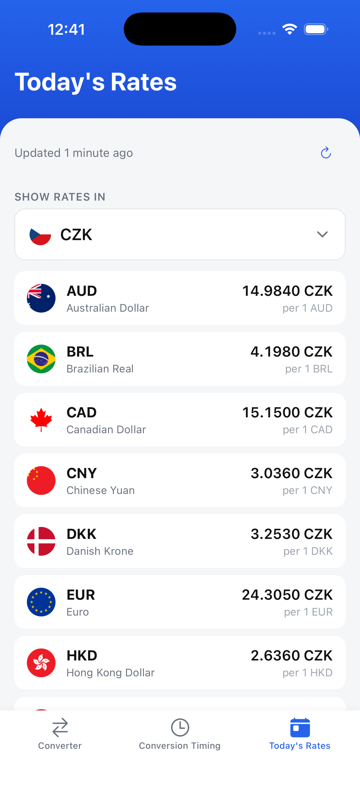
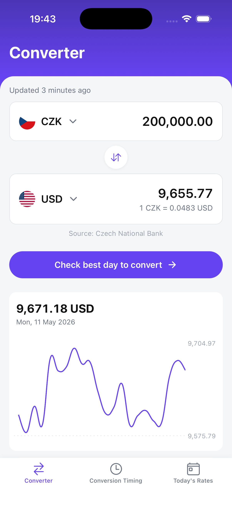
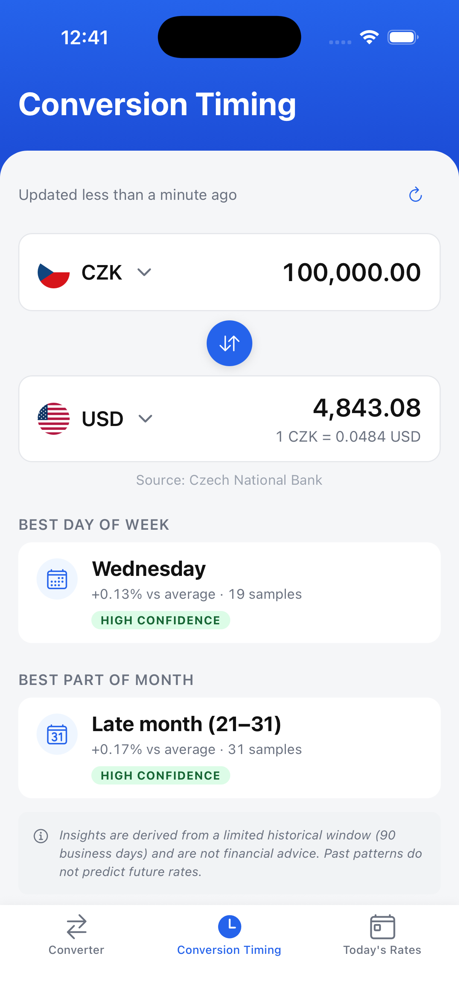

# Payout Spread

A small React Native app that turns the Czech National Bank's daily fixings into something useful: live CZK exchange rates, a CZK ⇄ foreign-currency converter, and a "best day to convert" view that shows how recent rate movements would have changed your payout.

Built with Expo SDK 54, React Native 0.81 and React 19.

> **For reviewers:** see [SUBMISSION.md](./SUBMISSION.md) for the requirements checklist, decision log, and notes on how I approached the brief.

## Screenshots

**Today**



**Converter**



**Conversion Timing**



## Features

- **Today** — pull-to-refresh list of CNB fixings for the current business day. Pick any currency (including CZK) as the reference and every other rate restates against it.
- **Converter** — calculator-style amount entry with a currency picker on each side. Defaults to the assignment's CZK → foreign flow but works in either direction. Recent conversions are kept locally for quick reuse.
- **Conversion Timing** — bonus screen that charts CZK yield for a fixed foreign amount over a recent window, highlights the best/worst day, and surfaces a short insight ("you'd get X more CZK if you'd waited until …").
- **Offline-friendly** — React Query state is persisted to AsyncStorage so the last-known rates are available immediately on cold start.
- **Native feel** — haptic feedback on key actions, safe-area aware layout, edge-to-edge on Android, light theme tuned for legibility.

## Getting started

Requires **Node 22** (see `.nvmrc`) and Yarn.

```sh
yarn               # install
yarn ios           # run on iOS simulator
yarn android       # run on Android emulator
yarn web           # run in the browser

yarn typecheck     # tsc --noEmit
yarn test          # jest
yarn format        # prettier --write .
```

The app loads CNB data on first launch — an internet connection is needed for the initial fetch.

## Project structure

```
src/
├── api/cnb/         CNB client, parser, React Query hooks
├── components/      Shared UI: cards, charts, calculator, currency picker
├── hooks/           Cross-screen helpers (e.g. useRatesWithCZK)
├── lib/             Pure logic: conversion math, insights, formatting
├── navigation/      Bottom tab navigator
├── screens/         TodayScreen, ConverterScreen, TimingScreen
├── state/           Zustand store for shared converter state
└── theme.ts         Colors, spacing, typography tokens
```

## Tech stack

| Area | Choice |
| --- | --- |
| Framework | Expo SDK 54 (blank-typescript), React Native 0.81, React 19 |
| Architecture | New Architecture enabled (Fabric + TurboModules + JSI) |
| Navigation | `@react-navigation/bottom-tabs` |
| Server state | `@tanstack/react-query` + AsyncStorage persister |
| Client state | `zustand` |
| Styling | `styled-components/native` v6 |
| Charts | `react-native-gifted-charts` (SVG) |
| Tests | Jest 29 + `jest-expo` |

## Architecture decisions

- **Expo, not bare RN.** `create-expo-app` is the current React Native team recommendation and gives a friction-free dev loop on iOS, Android, and Web from a single codebase.
- **React Navigation, not Expo Router.** The assignment specifies React Navigation; bottom tabs map naturally to the three screens.
- **Two state layers, by purpose.** React Query owns server state (fetching, caching, retries, persistence). Zustand owns the small amount of cross-screen UI state (selected currencies, current amount) that needs to stay in sync between Today, Converter, and Timing.
- **Pure logic in `lib/`.** Conversion math, insight builders, picker section grouping, and CNB parsing are plain functions with focused unit tests — no React, no mocks, fast feedback.
- **Aggregate query for Timing.** The Timing screen uses a single aggregate historical CNB request rather than N daily fetches, which keeps render churn and network cost low across the date window.
- **Jest pinned to 29.** `jest-expo@54` doesn't yet support Jest 30 — pinning avoids transform errors during test runs.
- **`styled-components` v6 only.** v6 ships its own types, so the legacy `@types/styled-components*` packages were removed to avoid type conflicts.

## Testing

Tests focus on the parts where bugs are easy to ship and easy to verify:

- CNB response parsing (with a captured fixture)
- Conversion math and rounding
- Calculator state machine
- Chart series and insight builders
- Currency picker section grouping
- One mocked render test for the converter form

React Navigation flows are exercised manually rather than under Jest.

## Submission notes

- The Converter opens in the assignment's requested CZK → foreign flow by default (`CZK → USD`) and supports bidirectional conversion thereafter.
- Conversion Timing is the bonus screen. It uses an aggregate historical CNB query and visualises CZK yield rather than the raw rate, since "what would I have actually received" is the question the screen exists to answer.

For the full requirements checklist, decision log, scope caveats, and instructions for generating native projects, see [SUBMISSION.md](./SUBMISSION.md).
